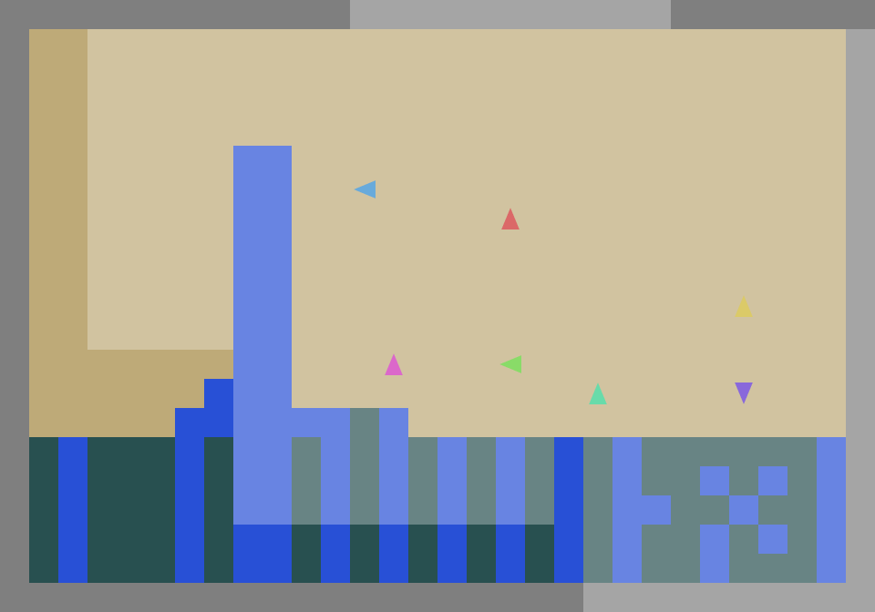

<h1 align="center">SocialJax Cleanup – Cooperation in Multi‑Agent RL</h1>

<p align="center">
  <a href="./RL%20Course%20Thesis%202.pdf">
    </a>
  <a href="./LICENSE">
    </a>
</p>

*A cleaned‑up fork of SocialJax focused on the Cleanup environment and the experiments from the thesis **“Cooperation in Multi‑Agent Reinforcement Learning”***.

This repository keeps the original JAX implementation of the **Cleanup** sequential social dilemma and adds a controlled experimental suite comparing cooperation mechanisms under PPO‑style training. All other environments from the original SocialJax have been removed to make this repo a focused, reproducible companion to the thesis.

The original SocialJax paper and code are by Guo et al. (2025); see the upstream project at https://github.com/cooperativex/SocialJax.

---

## 1. Environment: SocialJax Cleanup

All experiments use the JAX‑based SocialJax implementation of **Cleanup**, a sequential social dilemma with **7 learning agents**, a river that accumulates waste, and an apple orchard:

<p align="center">
  
</p>

- **Apples**: stepping on an apple yields `+1` reward for that agent.
- **Cleaning waste**: firing the clean beam on river waste gives **no direct reward**, but reduces pollution. A cleaner river increases apple respawn; a polluted river eventually stops apples respawning.
- Observations are egocentric crops around each agent (local grid with apples, waste, walls, and other agents).
- Actions include movement, head rotation, and the clean beam.

The environment implementation lives in `socialjax/environments/cleanup`, and you can construct it via:

```python
from socialjax import make

env = make("clean_up", num_agents=7)
```

---

## 2. Algorithms and Conditions (C0–C4)

Across all conditions we use on‑policy PPO‑style updates with convolutional actor–critic networks. The key differences are in how rewards are shaped and how credit is assigned.

### Shared architecture

- **Policy network**: 3‑layer CNN over egocentric observations, followed by a dense layer and:
  - an **actor head** producing a categorical policy over discrete actions (via `distrax`),
  - a **critic head** producing a scalar value estimate.
- **Parameter sharing**: in C0–C3, a single set of parameters is shared across all 7 agents (independent actor–critics with shared weights). In C4, the innovator and imitators have separate shared‑parameter networks.
- Activations use `bfloat16` for intermediates and `float32` parameters, matching the original SocialJax setup.

### C0 – IPPO, self‑interested baseline

- Script: `algorithms/IPPO/ippo_cnn_cleanup.py` with `ENV_KWARGS.shared_rewards=False`, `REWARD=individual`.
- Each agent maximises its **own** apple reward using independent PPO (IPPO) with shared parameters.
- No payoff shaping; no explicit credit assignment beyond the shared critic.

### C1 – IPPO with team reward (Class I: payoff shaping)

- Script: `algorithms/IPPO/ippo_cnn_cleanup.py` with `ENV_KWARGS.shared_rewards=True`, `REWARD=common`.
- All agents receive the **same team reward**, equal to the average apples collected across agents at each step:
  \[
    r_i^{\text{team}}(t) = \frac{1}{N}\sum_{j=1}^N r_j(t).
  \]
- Same IPPO architecture as C0; only the reward signal is pooled.

### C2 – Social Value Orientation (SVO) shaping (Class I)

- Script: `algorithms/SVO/svo_cnn_cleanup.py`.
- Uses the `SVOLogWrapper` from SocialJax to mix own and others’ rewards:
  \[
    r_i^{\text{SVO}}(t)
    = \cos(\theta)\, r_i(t) + \sin(\theta)\, r_{-i}(t)
  \]
  where \(\theta\) is the SVO angle and \(r_{-i}(t)\) is the mean reward of the other agents.
- Still IPPO with shared parameters; only the reward is shaped according to the chosen SVO configuration.

### C3 – MAPPO with centralised critic (Class II: credit assignment)

- Script: `algorithms/MAPPO/mappo_cnn_cleanup.py`.
- Uses a **centralised critic** and shared team reward:
  - Actor: shared, decentralised policy over local observations (as in C1/C2).
  - Critic: takes a stacked “world state” tensor combining all agents’ local views via `MAPPOWorldStateWrapper`.
- Advantages for all agents are computed using this global value function; at execution time only the decentralised policy is used.

### C4 – Reciprocity via innovator/imitator dynamics (Class IV)

- Script: `algorithms/IPPO/ippo_cnn_cleanup_c4.py`.
- One **innovator** agent learns from its own environment reward (like C0).
- Six **imitators** use the same IPPO architecture but receive an additional intrinsic reward encouraging their cleaning behaviour to match the innovator’s “niceness” trace:
  \[
    N_i(t) = \gamma_n N_i(t-1) + n_i(t),
  \]
  where \(n_i(t)\) indicates a cleaning action at time \(t\).
- Imitator reward:
  \[
    r_{\text{im},k}^{\text{tot}}(t)
    = r_{\text{im},k}^{\text{env}}(t)
    + \lambda_{\text{im}} \bigl(-\,(N_{\text{im},k}(t) - N_{\text{inv}}(t))^2\bigr).
  \]
- Innovator and imitators are trained with separate shared‑parameter actor–critics but identical optimisation hyperparameters.

---

## 3. Overall Empirical Results (Summary)

All runs are trained with a common budget of **100M environment timesteps** per condition on Cleanup with 7 agents.

### Overall ordering (social welfare)

Based on team apples, cleaned water, and evaluation metrics, the conditions are ordered approximately as:

\[
  \textbf{C3 (MAPPO)}
  \;>\;
  \textbf{C2 (SVO)}
  \;>\;
  \textbf{C1 (team reward)}
  \;>\;
  \textbf{C4 (reciprocity)} \approx \textbf{C0 (self‑interested)}.
\]

- **C3 (MAPPO)** almost fully resolves the Cleanup social dilemma, sustaining a clean river and high, stable team returns.
- **C2 (SVO)** substantially outperforms the self‑interested baseline, showing that simple payoff shaping can induce more cooperative behaviour.
- **C1 (team reward)** cleans more but collects slightly fewer apples than C2, suggesting that naive reward pooling alone does not fix credit assignment.
- **C4 (reciprocity)** is brittle: with PPO‑style updates, the innovator often converges to a selfish policy before discovering the cooperative regime, causing imitators to copy defection.
- **C0 (self‑interested IPPO)** collapses into a classic tragedy of the commons with low apples and poor river health.

### Equality and stability (Gini index)

Using the Gini index of per‑agent episode returns (lower is more equal), the final ordering is roughly:

\[
  \text{C4 } (0.94)
  \;>\;
  \text{C0 } (0.40)
  \;>\;
  \text{C3 } (0.36)
  \;>\;
  \text{C2 } (0.19)
  \;>\;
  \text{C1 } (0.18).
\]

- C4’s extreme inequality is largely a **scarcity artifact**: when very few apples are produced, even small random advantages look highly unequal.
- C0 similarly exhibits high, noisy Gini due to near‑zero average returns.
- C2 and C3 achieve both higher welfare and more equal sharing of returns.

### Runtime on A100 40GB

All reported experiments were run on a single **Nvidia A100 40GB** GPU:

- **C0 (IPPO), C1 (team reward), C2 (SVO), C4 (reciprocity)**:
  - Typical run time ≈ **43 minutes** per 100M‑step run.
- **C3 (MAPPO)**:
  - Typical run time ≈ **2 hours 12 minutes** per 100M‑step run.

Centralised critics provide the best welfare but come with a clear computational cost.

---

## 4. Training Curves and Evaluation Plots

This repo includes key W&B export plots under `w&b charts`. Below are some of the most important ones:

<p align="center">
  
  
 
</p>

<p align="center">
   
  
</p>


These plots correspond directly to the figures discussed in the thesis (e.g., team apples, cleaned water, clean‑action rate, and Gini index over training and at evaluation).

---

## 5. Policy Rollouts (GIFs)

The repository includes rollout GIFs for each condition in `evaluation/cleanup`. They provide a visual comparison of learned behaviour:

<p align="center">
  
  
  
  
  
</p>

- **C0 (IPPO, individual reward)**: agents harvest greedily, over‑exploit the river, and the orchard collapses.
- **C1 (team reward)**: agents clean more consistently, but coordination between cleaning and harvesting is imperfect.
- **C2 (SVO)**: more balanced cooperative patterns emerge; agents maintain river health and harvest effectively.
- **C3 (MAPPO)**: most stable cooperative policy; sustained cleaning with high apple yields.
- **C4 (reciprocity)**: imitators try to match the innovator, but if the innovator defects early, the whole population converges to low‑cleaning, low‑reward behaviour.

---

## 6. Reproducing the Experiments

The recommended setup mirrors the configuration used for the experiments and is designed to fit comfortably on a single A100 40GB GPU (and also on a 24GB A10).

### 6.1 Environment and dependencies

From the project root (this directory), using conda:

```bash
# create and activate env
conda create -n socialjax python=3.10 -y
conda activate socialjax

# install JAX with CUDA 11 wheels
pip install "jax[cuda11_pip]==0.4.23" \
  -f https://storage.googleapis.com/jax-releases/jax_cuda_releases.html

# match CUDA libs and NumPy/SciPy versions from the thesis runs
pip install --force-reinstall "nvidia-cudnn-cu11==8.6.0.163"
pip install numpy==1.26.4 scipy==1.10.1

# install SocialJax + experiment dependencies
pip install -r requirements.txt

# add the SocialJax package to PYTHONPATH
export PYTHONPATH=$(pwd)/socialjax:$PYTHONPATH

# optional: log to Weights & Biases
wandb login
```

You can verify that JAX sees your GPU with:

```bash
python - <<'PY'
import jax, jaxlib
print("JAX:", jax.__version__, "jaxlib:", jaxlib.__version__)
print("Devices:", jax.devices())
PY
```

### 6.2 Hyperparameters (A100‑friendly settings)

For the main experiments we use:

- **IPPO (C0/C1) and SVO (C2)**:
  - `NUM_ENVS = 32`
  - `NUM_STEPS = 256`
  - `NUM_MINIBATCHES = 224`
  - `TOTAL_TIMESTEPS = 100_000_000`
  - With 7 agents, this yields a batch size of `32 × 7 × 256 = 57,344`, split into minibatches of size 256. These settings fit within 24GB and therefore comfortably within 40GB.

- **MAPPO (C3)**:
  - Default values in the config (e.g., `NUM_ENVS = 4`, `NUM_STEPS = 100`, `NUM_MINIBATCHES = 4`) with:
  - `TOTAL_TIMESTEPS = 100_000_000`.

- **Reciprocity (C4)**:
  - Uses the same budget and broadly similar PPO settings to IPPO, with separate innovator and imitator networks.

If you encounter OOM issues on smaller GPUs, reduce `NUM_ENVS` and/or `NUM_STEPS`, ensuring that `NUM_MINIBATCHES` divides `NUM_ENVS * num_agents * NUM_STEPS`.

### 6.3 Launch commands

From within `SocialJax/` (this directory), with the `socialjax` environment active:

```bash
export PYTHONPATH=$(pwd)/socialjax:$PYTHONPATH

# C0 – IPPO, individual rewards (self‑interested baseline)
python algorithms/IPPO/ippo_cnn_cleanup.py \
  PROJECT=socialjax-cleanup ENTITY= \
  TOTAL_TIMESTEPS=100000000 NUM_ENVS=32 NUM_STEPS=256 NUM_MINIBATCHES=224 \
  ENV_KWARGS.shared_rewards=False REWARD=individual \
  CONDITION=C0 MECHANISM_CLASS=Baseline RUN_NAME=C0_seed0 SEED=0

# C1 – IPPO, team rewards (payoff pooling)
python algorithms/IPPO/ippo_cnn_cleanup.py \
  PROJECT=socialjax-cleanup ENTITY= \
  TOTAL_TIMESTEPS=100000000 NUM_ENVS=32 NUM_STEPS=256 NUM_MINIBATCHES=224 \
  ENV_KWARGS.shared_rewards=True REWARD=common \
  CONDITION=C1 MECHANISM_CLASS=ClassI RUN_NAME=C1_seed1 SEED=1

# C2 – SVO shaping
python algorithms/SVO/svo_cnn_cleanup.py \
  PROJECT=socialjax-cleanup ENTITY= \
  TOTAL_TIMESTEPS=100000000 NUM_ENVS=32 NUM_STEPS=256 NUM_MINIBATCHES=224 \
  CONDITION=C2 MECHANISM_CLASS=ClassI RUN_NAME=C2_seed0 SEED=0

# C3 – MAPPO with centralised critic
python algorithms/MAPPO/mappo_cnn_cleanup.py \
  PROJECT=socialjax-cleanup ENTITY= \
  TOTAL_TIMESTEPS=100000000 \
  CONDITION=C3 MECHANISM_CLASS=ClassII+III RUN_NAME=C3_seed1 SEED=1

# C4 – Reciprocity (innovator + imitators)
python algorithms/IPPO/ippo_cnn_cleanup_c4.py \
  PROJECT=socialjax-cleanup ENTITY= \
  TOTAL_TIMESTEPS=100000000 NUM_ENVS=32 NUM_STEPS=256 NUM_MINIBATCHES=224 \
  CONDITION=C4 MECHANISM_CLASS=ClassIV RUN_NAME=C4_seed0 SEED=0
```

These commands reproduce the training runs used for the empirical comparison. W&B metrics and GIFs are written automatically if `wandb` is configured.

---

## 7. Quick Start: Using the Cleanup Environment

You can still use this repo as a lightweight Cleanup environment provider for your own MARL experiments:

```python
import jax
from socialjax import make

num_agents = 7
env = make("clean_up", num_agents=num_agents)
rng = jax.random.PRNGKey(0)
rng, rng_reset = jax.random.split(rng)

obs, state = env.reset(rng_reset)
for t in range(100):
    rng, *rngs = jax.random.split(rng, num_agents + 1)
    actions = {
        a: jax.random.randint(rngs[a], shape=(), minval=0, maxval=env.action_space(a).n)
        for a in env.agents
    }
    obs, state, reward, done, info = env.step(rng, state, actions)
    if done["__all__"]:
        break
```

---

## 8. License and Attribution

- This repository is a derivative work of **SocialJax** by Guo et al. (2025).
- The code is distributed under the **Apache 2.0 License**; see `LICENSE` for full terms.
- Modifications in this fork include:
  - removing all environments except Cleanup,
  - adding Cleanup‑specific IPPO, SVO, MAPPO, and reciprocity scripts,
  - adding experiment‑oriented logging utilities, plots, and documentation to support the thesis **“Cooperation in Multi‑Agent Reinforcement Learning”**.

Please cite both the thesis and the original SocialJax paper if you build on this work.
